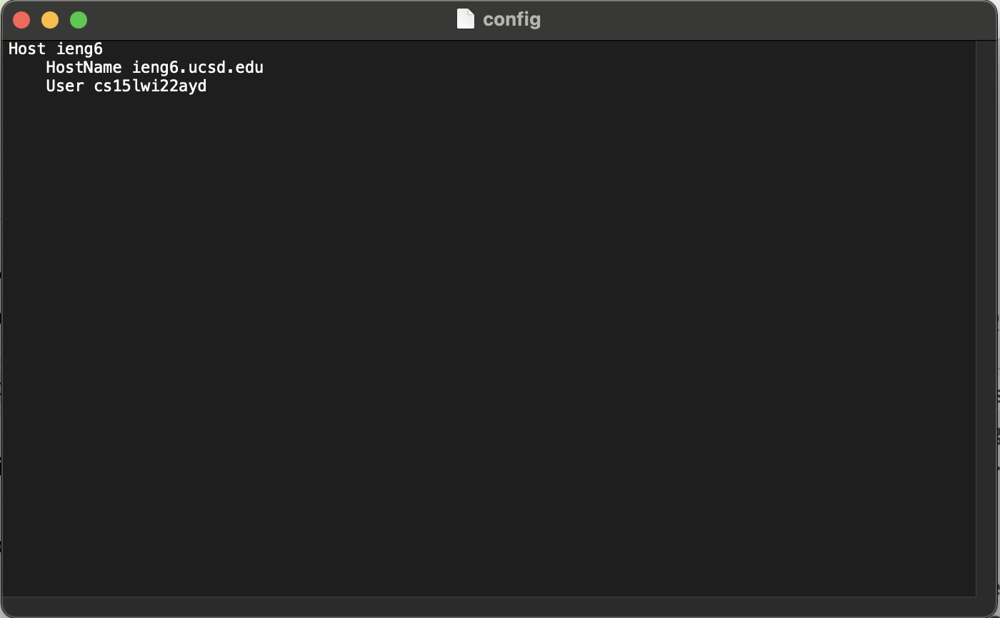
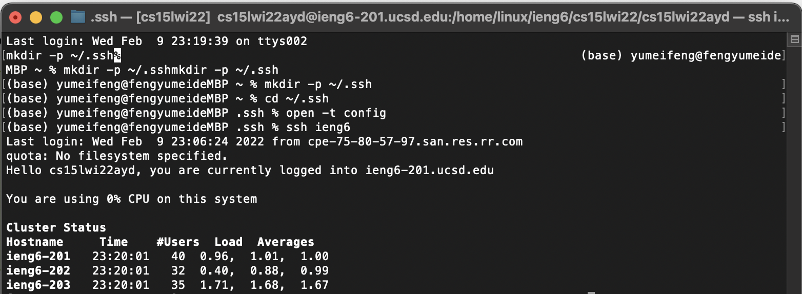
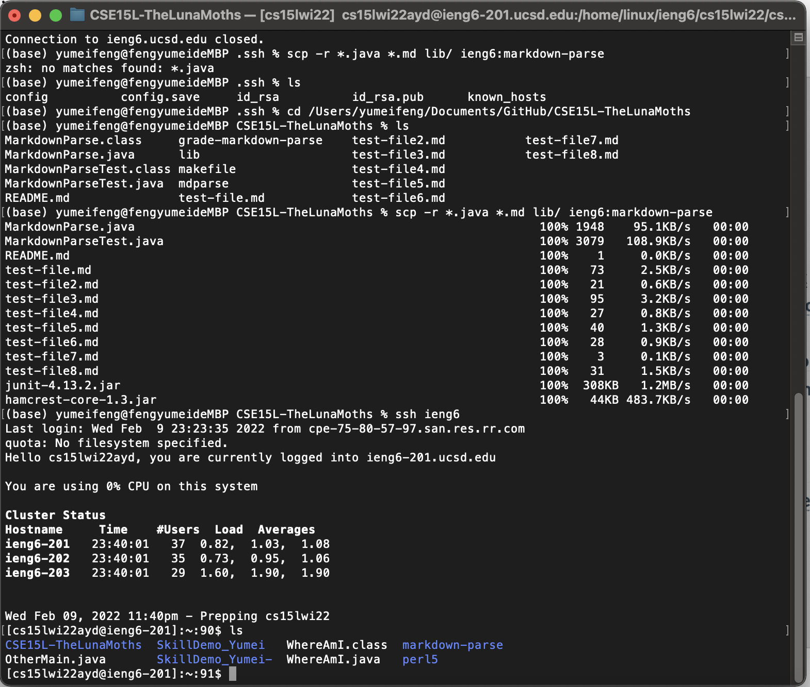

# Lab Report 3 
## Prompt 1: Streamlining ssh Configuration
### My .ssh/config file
#### Explanation
I first followed a series of steps to set up the config file on my computer. I then edited the config file to change the alias to ieng6. 

### Log in with alias name 
I then use the command 'ssh ieng6' to log onto the remote server with the simplified alias 

### scp command using alias name 
I then use the command 'scp -r *.java *.md lib/ ieng6:markdown-parse'to copy files onto the remote server using just the alias ieng6

